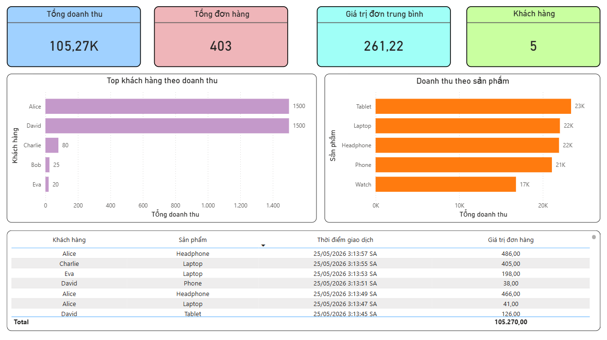
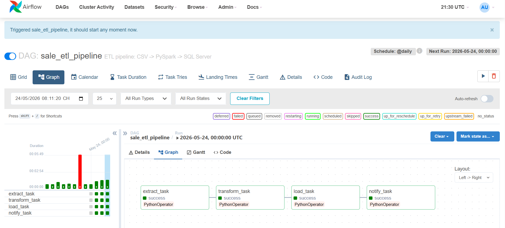

# 🏪 E-commerce Sales Analytics Pipeline

## 📌 Giới thiệu
Project xây dựng hệ thống data pipeline end-to-end kết hợp 
batch processing và real-time streaming cho bài toán phân tích 
doanh thu thương mại điện tử.

> ⚠️ Data trong project là data mẫu tự tạo cho mục đích học tập.

## 🏗 Kiến trúc
```
Batch Layer:
sales.csv → PySpark (ETL) → SQL Server → Power BI

Streaming Layer:
Kafka Producer → Kafka Topic → Kafka Consumer → SQL Server → Power BI
                                    ↑
                              Airflow DAG (@daily)
```

## 🛠 Tech Stack
| Layer | Tool |
|---|---|
| Batch Processing | PySpark |
| Stream Ingestion | Apache Kafka |
| Orchestration | Apache Airflow |
| Storage | SQL Server |
| Visualization | Power BI (DirectQuery) |
| Infrastructure | Docker |

## 📊 Dashboard
Power BI DirectQuery — tự động refresh mỗi 10 giây



## 🔄 Pipeline chi tiết

### Batch Pipeline
- `etl/extract.py` → đọc `data/sales.csv` bằng PySpark
- `etl/transform.py` → group by customer, tính total_spent
- `etl/load.py` → insert vào bảng `customer_spending`
- `airflow/dags/sale_etl_dag.py` → schedule @daily, 4 tasks

## ⚙️ Airflow Pipeline
4 tasks chạy tuần tự: extract → transform → load → notify



### Streaming Pipeline
- `kafka/producer.py` → giả lập đơn hàng realtime mỗi 2 giây
- `kafka/consumer.py` → đọc từ topic `sales_topic` → insert `sales_realtime`

## 📹 Demo

### Kafka Streaming + Power BI Realtime
[](https://youtu.be/-tTymz6CrvA)
> Click ảnh để xem video demo

## 🐳 Khởi động project

### 1. Start containers
```bash
docker-compose up -d
```

### 2. Chạy Kafka streaming
```bash
# Terminal 1
python kafka/producer.py

# Terminal 2
python kafka/consumer.py
```

### 3. Trigger batch pipeline
Vào http://localhost:8081 → DAGs → sale_etl_pipeline → ▶️

## 📁 Cấu trúc project
```
bigdata-project/
├── airflow/dags/
│   ├── main.py               # ETL entry point
│   └── sale_etl_dag.py       # Airflow DAG (4 tasks)
├── data/
│   └── sales.csv             # Raw data
├── etl/
│   ├── extract.py            # PySpark extract
│   ├── transform.py          # PySpark transform
│   └── load.py               # Load vào SQL Server
├── kafka/
│   ├── producer.py           # Kafka producer
│   └── consumer.py           # Kafka consumer
├── sql/
│   └── create_table.sql      # DDL scripts
├── dashboard/
│   └── dashboard.png         # Power BI screenshot
├── Dockerfile
└── docker-compose.yml
```

## 🗄 Database Schema
```sql
CREATE TABLE customer_spending (
    customer    VARCHAR(100),
    total_spent FLOAT,
    created_at  DATETIME DEFAULT DATEADD(HOUR, 7, GETUTCDATE())
);

CREATE TABLE sales_realtime (
    id         INT IDENTITY(1,1) PRIMARY KEY,
    customer   VARCHAR(100),
    product    VARCHAR(100),
    amount     FLOAT,
    created_at DATETIME DEFAULT DATEADD(HOUR, 7, GETUTCDATE())
);
```